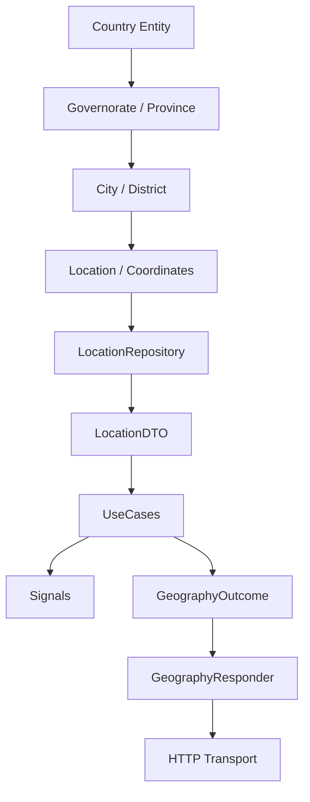

# Architecture Blueprint: Ugarit Geography Artifact

The Geography Artifact strictly follows the **Artifact-Driven Architecture (ADA)**, isolating territorial capabilities from application business logic and presentation starter kits.

---

## Hierarchical Pipeline

---

## Layer Invariants

1. **Zero UI Assets:** No map widgets, Blade templates, or address form components live in this artifact.
2. **Model Encapsulation:** `Country`, `Governorate`, `City`, and `Location` Eloquent models remain private to repositories and are mapped exclusively to typed DTOs.
3. **Outcome Envelope:** Operations return `GeographyOutcome` instances.
