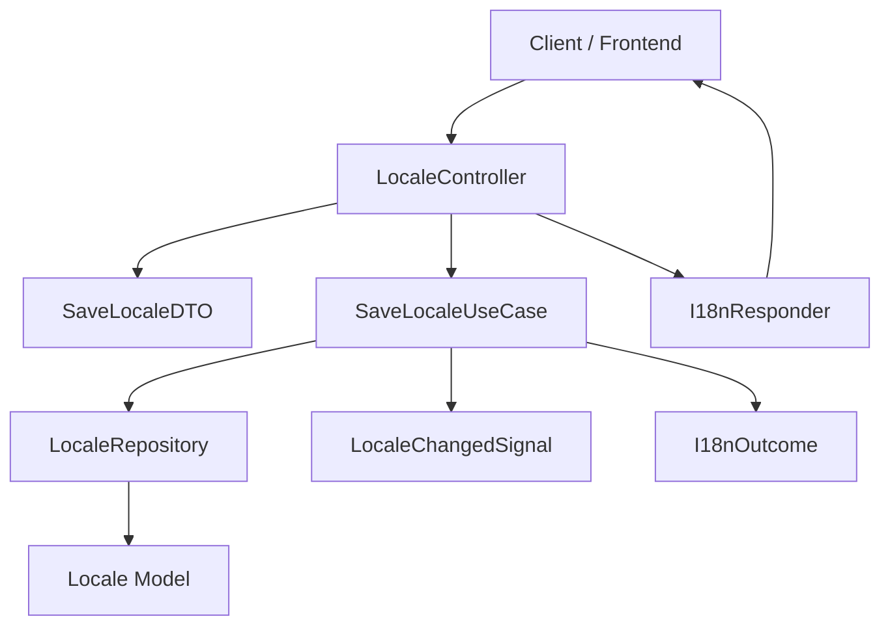

# Architecture Blueprint: Ugarit I18n Artifact

The I18n Artifact strictly follows the **Artifact-Driven Architecture (ADA)**, guaranteeing clear separation between technical capabilities, business features, and presentation tiers.

---

## The Execution Pipeline

---

## Layer Boundaries & Strict Invariants

1. **Controllers (`src/Http/Controllers/`):**
   * Only dispatch requests. They validate input, instantiate typed DTOs, invoke UseCases, and pass the resulting **`I18nOutcome`** to the **`I18nResponder`**.
   * Contain strictly zero SQL queries, zero model updates, and zero view logic.
2. **DTOs (`src/DTOs/`):**
   * Immutable typed containers (`LocaleDTO`, `LanguageDTO`, `SaveLocaleDTO`).
3. **UseCases (`src/Services/UseCases/`):**
   * Encapsulate a single business operation (`IndexLocalesUseCase`, `SaveLocaleUseCase`, `DestroyLocaleUseCase`).
   * Emit **`Signals`** upon mutation and return an **`I18nOutcome`**.
4. **Repositories (`src/Repositories/`):**
   * Encapsulate Eloquent queries. Always map Models to DTOs.
   * **Rule:** Never leak `Locale` or `Language` Eloquent models past the repository interface.
5. **Outcomes (`src/Outcomes/`):**
   * Agnostic envelopes conveying execution state, payload, and client feedback descriptors (toasts/alerts).
6. **Responders (`src/Http/Responders/`):**
   * Adapt the agnostic Outcome to HTTP JSON, Inertia props, or redirects.
